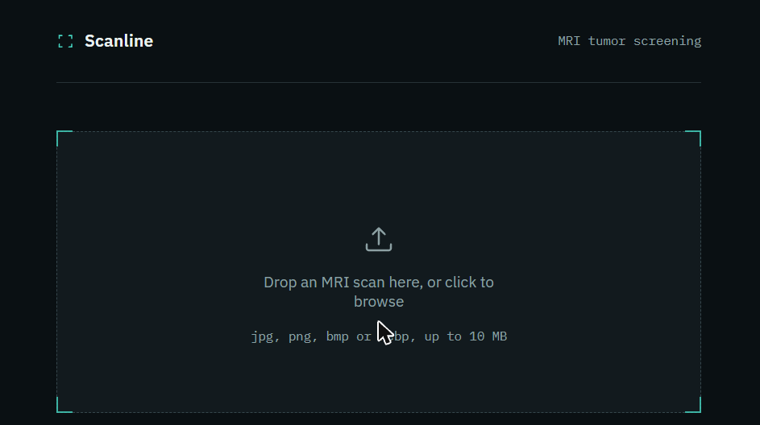
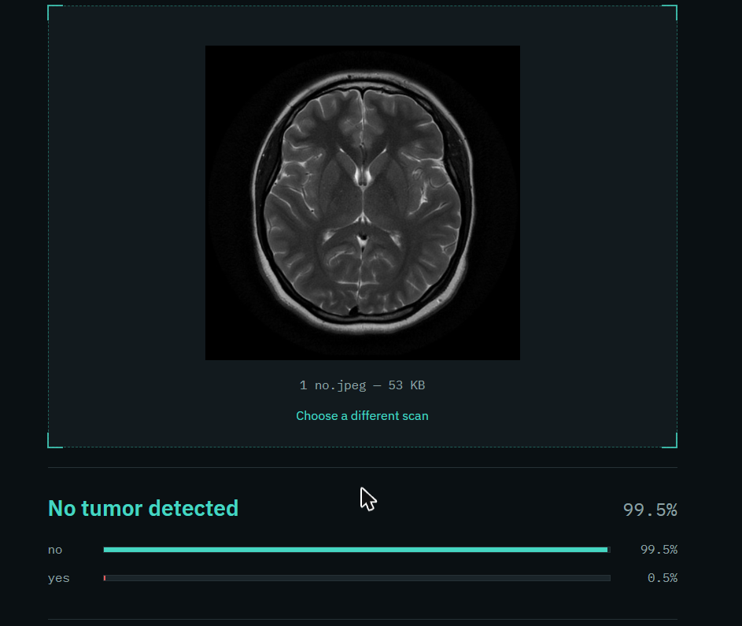
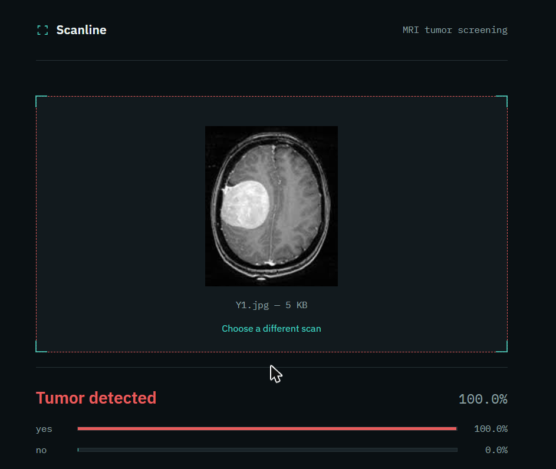
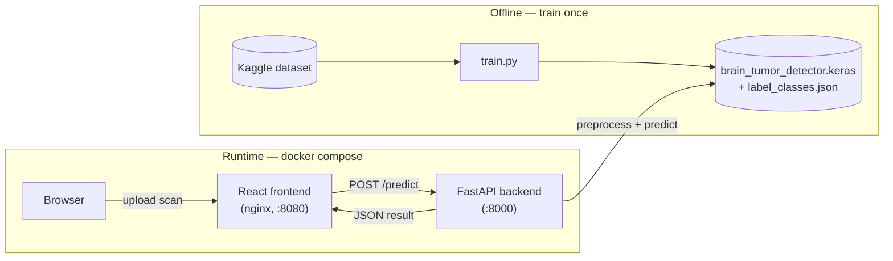
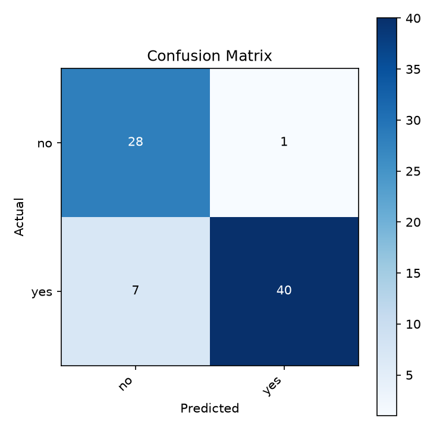
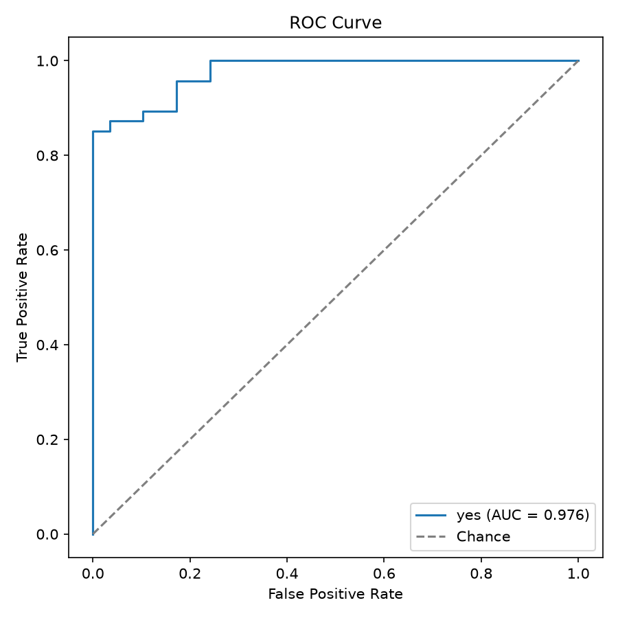
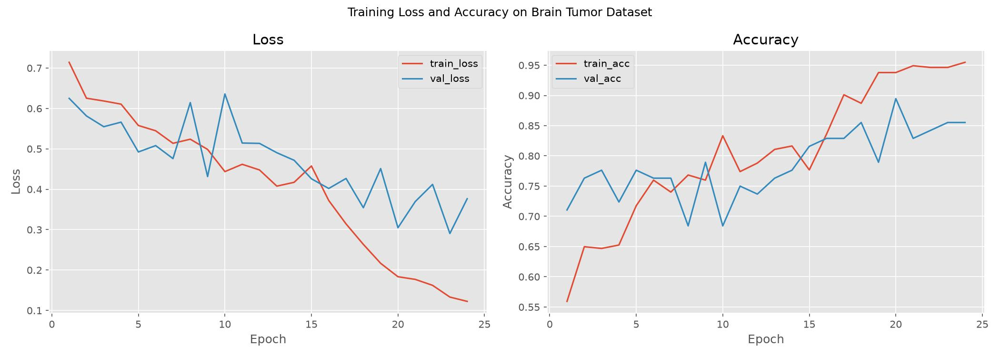

# Brain Tumor Detection


A full-stack MRI tumor screening app: a VGG16 transfer-learning model classifies brain
MRI scans as **tumor** or **no tumor**, served through a FastAPI backend and a React
frontend ("Scanline"), all containerized with Docker.

Dataset: [Brain MRI Images for Brain Tumor Detection](https://www.kaggle.com/datasets/navoneel/brain-mri-images-for-brain-tumor-detection) (Kaggle).

> **This is an educational project, not a medical device.** See the [Disclaimer](#disclaimer).

## Contents

- [Screenshots](#screenshots)
- [Architecture](#architecture)
- [Project structure](#project-structure)
- [Quickstart (Docker)](#quickstart-docker)
- [Manual setup](#manual-setup)
- [Training](#training)
- [Predicting from the CLI](#predicting-from-the-cli)
- [Backend API](#backend-api)
- [Frontend](#frontend)
- [Tests](#tests)
- [Latest run results](#latest-run-results)
- [Disclaimer](#disclaimer)

## Screenshots

<table>
<tr>
<td width="33%">

**Upload**



</td>
<td width="33%">

**No tumor**



</td>
<td width="33%">

**Tumor detected**



</td>
</tr>
</table>

## Architecture



`inference.py` holds the shared preprocessing/prediction logic used by `train.py`,
`predict.py`, and the backend, so there's one place that knows how to turn an image
into a prediction.

## Project structure

```
BrainTumorDetection/
├── train.py                    # end-to-end training pipeline
├── predict.py                   # CLI: run the trained model on a single image
├── inference.py                  # shared preprocessing/prediction logic
├── requirements.txt                # core ML dependencies
├── requirements-dev.txt             # + pytest/httpx for running tests
├── docker-compose.yml
├── backend/
│   ├── app.py                        # FastAPI service (GET /health, POST /predict)
│   ├── requirements.txt
│   └── Dockerfile
├── frontend/                          # React (Vite) UI — "Scanline"
│   ├── src/
│   ├── nginx.conf
│   └── Dockerfile
├── tests/
│   ├── test_inference.py
│   └── test_api.py
├── docs/images/                        # screenshots + result plots used in this README
│
└── (generated after running train.py — gitignored)
    ├── brain_tumor_detector.keras       # trained model
    ├── label_classes.json               # class name -> index mapping
    ├── plot.jpg                         # training/validation loss & accuracy curves
    ├── confusion_matrix.png             # confusion matrix on the held-out test set
    ├── roc_curve.png                    # ROC curve with AUC
    ├── training_history.csv             # per-epoch metrics, both training phases
    └── classification_report.txt        # precision/recall/F1 per class
```

> The artifacts under "generated after running train.py" aren't committed — they're
> real outputs of an actual training run, and only exist once you've run `train.py`
> yourself. Committing placeholder versions would be misleading, so they're left out
> on purpose. (The copies under `docs/images/` are curated snapshots for this README,
> not build outputs.)

## Quickstart (Docker)

Once you have a trained model (see [Training](#training)) sitting at the repo root:

```bash
docker compose up -d --build
```

- Frontend: [http://localhost:8080](http://localhost:8080)
- Backend: [http://localhost:8000](http://localhost:8000) (`/health`, `/predict`)

`docker-compose.yml` bind-mounts `brain_tumor_detector.keras` and `label_classes.json`
into the backend container read-only, so re-training doesn't require rebuilding the
image — just restart the backend service.

## Manual setup

```bash
pip install -r requirements.txt
```

If you're on Colab, `opencv-python-headless`, `numpy`, `matplotlib`, and `scikit-learn`
are usually preinstalled — you'll mainly need `imutils`.

## Training

```bash
python train.py --dataset-path brain_tumor_dataset
```

If `brain_tumor_dataset/` doesn't exist locally, `train.py` will try to download it from
Kaggle automatically (requires the `kaggle` CLI configured with an API token, or
`kagglehub` installed).

Useful options:

```bash
python train.py \
  --dataset-path brain_tumor_dataset \
  --output-dir . \
  --batch-size 8 \
  --head-epochs 15 \
  --finetune-epochs 10 \
  --head-lr 1e-3 \
  --finetune-lr 1e-5
```

Run `python train.py --help` for the full list of options.

### What training does

1. Loads and preprocesses all images (resize to 224×224, RGB, normalized to [0, 1]).
2. Splits into stratified train / validation / test sets (test set is never touched
   until final evaluation, to avoid leakage).
3. Builds a VGG16 base (frozen, ImageNet weights) with a small classification head
   (`AveragePooling2D → Flatten → Dense(64, relu) → Dropout(0.5) → Dense(softmax)`).
4. **Phase 1:** trains the classification head only, with the VGG16 base frozen.
5. **Phase 2:** unfreezes the last VGG16 conv block and fine-tunes end-to-end at a
   much lower learning rate.
6. Applies class weighting to handle any tumor/no-tumor imbalance in the dataset.
7. Uses early stopping, learning-rate reduction on plateau, and checkpointing
   throughout, so it won't overfit or waste epochs.
8. Evaluates on the held-out test set and saves the confusion matrix, ROC curve,
   classification report, and training curves.

## Predicting from the CLI

Once you have a trained model:

```bash
python predict.py --image path/to/scan.jpg
```

```
--- Prediction ---
Image:      scan.jpg
Prediction: yes
Confidence: 96.42%

All class probabilities:
  no        :   3.58%
  yes       :  96.42%
```

By default it looks for `brain_tumor_detector.keras` and `label_classes.json` in the
current directory; override with `--model` and `--labels` if you've moved them. Run it
with no `--image` flag and it falls back to an interactive prompt.

## Backend API

Run it from the repo root so it can find `inference.py` and the model files:

```bash
pip install -r backend/requirements.txt
uvicorn backend.app:app --reload --port 8000
```

| Method | Path       | Description                                                   |
| ------ | ---------- | -------------------------------------------------------------- |
| GET    | `/health`  | `200` with class names if the model loaded, `503` otherwise.   |
| POST   | `/predict` | Multipart image upload (`file` field) → prediction + confidence. |

```bash
curl -F "file=@scan.jpg;type=image/jpeg" http://localhost:8000/predict
```

```json
{
  "predicted_class": "yes",
  "confidence": 0.9998587369918823,
  "all_probabilities": { "no": 0.00014121798, "yes": 0.9998587369918823 }
}
```

Accepts JPEG/PNG/BMP/WebP up to 10 MB; rejects anything else with a `400`, and
oversized files with a `413`. CORS defaults to `localhost:5173/3000/8080`, overridable
via the `CORS_ORIGINS` env var (comma-separated).

## Frontend

```bash
cd frontend
npm install
cp .env.example .env   # VITE_API_BASE_URL, defaults to http://localhost:8000
npm run dev
```

Open [http://localhost:5173](http://localhost:5173). `npm run build` produces a static
`dist/` (this is what the Docker image serves via nginx).

## Tests

```bash
pip install -r requirements-dev.txt
pytest -v
```

`tests/test_inference.py` is self-contained (fake model, synthetic images — no
dataset or trained model needed). `tests/test_api.py` is a real integration suite
against the actual trained model, and auto-skips if `brain_tumor_detector.keras` /
`label_classes.json` aren't present yet.

## Latest run results

Results from an actual training run — `python train.py --dataset-path brain_tumor_dataset`
(defaults: `--head-epochs 15 --finetune-epochs 10 --batch-size 8`) — against the full
506-image dataset (354 train / 76 validation / 76 test, stratified by class).

### Test set — the numbers that matter

This is the held-out test set: never touched during training or validation, evaluated
exactly once at the end.

<table>
<tr><td width="45%">

**Accuracy: 89.47%**

|     | Precision | Recall | F1   | Support |
| --- | --------- | ------ | ---- | ------- |
| no  | 0.80      | 0.97   | 0.88 | 29      |
| yes | 0.98      | 0.85   | 0.91 | 47      |

</td><td>



</td></tr>
</table>

> Recall on `no` (97%) is higher than recall on `yes` (85%) — the model is more likely
> to miss a tumor than to flag a false one. Combined with the confidence-based warning
> in `predict.py`, treat any `yes`-leaning-but-low-confidence result as inconclusive
> rather than a confident "no tumor."



### Training curve

**Phase 1 — head training** (VGG16 frozen, lr = 1e-3)
Ran 14 of 15 requested epochs; `EarlyStopping` (patience 5, monitor `val_loss`) kicked
in and restored the best weights from epoch 9:

|          | Epoch 1 (start) | Epoch 9 (best, restored) | Epoch 14 (last run) |
| -------- | --------------- | ------------------------ | -------------------- |
| Accuracy | 55.9% / 71.1%   | 77.0% / **78.9%**         | 81.6% / 77.6%         |
| Loss     | 0.714 / 0.625   | 0.545 / **0.431**         | 0.417 / 0.472         |

*(format: train / validation)*

**Phase 2 — fine-tuning** (last VGG16 conv block unfrozen, lr = 1e-5)
Ran the full 10 epochs; the final model uses the best weights, restored from epoch 6:

| Epoch | Train Acc | Val Acc   | Train Loss | Val Loss  |
| ----- | --------- | --------- | ---------- | --------- |
| 1     | 77.7%     | 81.6%     | 0.458      | 0.426     |
| 3     | 88.7%     | 85.5%     | 0.264      | 0.354     |
| 6     | **93.8%** | **89.5%** | **0.183**  | **0.305** |
| 8     | 94.6%     | 85.5%     | 0.133      | 0.290     |
| 10    | 95.5%     | 85.5%     | 0.122      | 0.377     |

Epoch 6 had the lowest validation loss of the run, so those are the weights saved to
`brain_tumor_detector.keras` — which lines up with the 89.47% test accuracy above.



> Full per-epoch numbers for both phases are in `training_history.csv`.

## Disclaimer

This project is for educational purposes only. It is **not** a medical device and must
not be used for actual clinical diagnosis. Any real-world use of MRI-based tumor
detection should involve a qualified radiologist and a properly validated, regulated
system.
